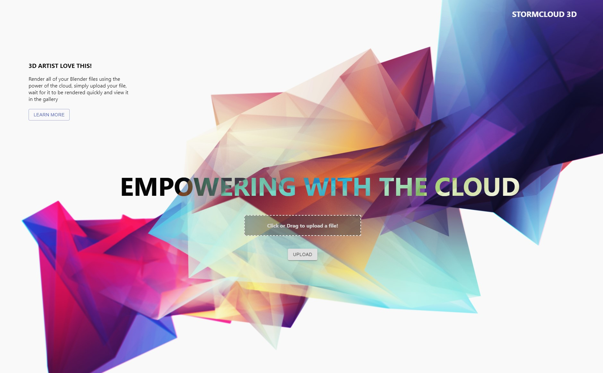
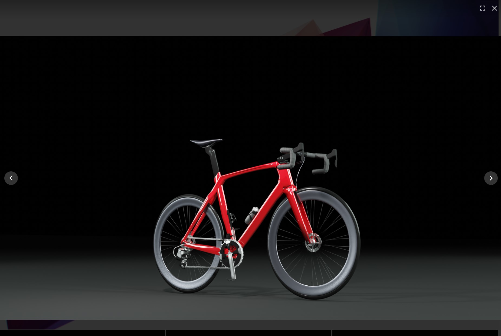

# Storm Cloud 3D

Web Based Cloud Rendering Application - All Renders are performed using AWS EC2 GPU Instances for quick render time.

Front end upload of files are stored in an AWS S3 Bucket. Upon upload a SQS Queue launches a EC2 Instance as required. This instance then retreives the file from the queue, renders the file in Blender using the Blender CLI and saves the result to an output S3 Bucket.

A CloudWatch policy and scaling group ensures the pool of compute instances are scaled depending on demand.

The result is then uploaded to a public gallery and emailed to the user.

