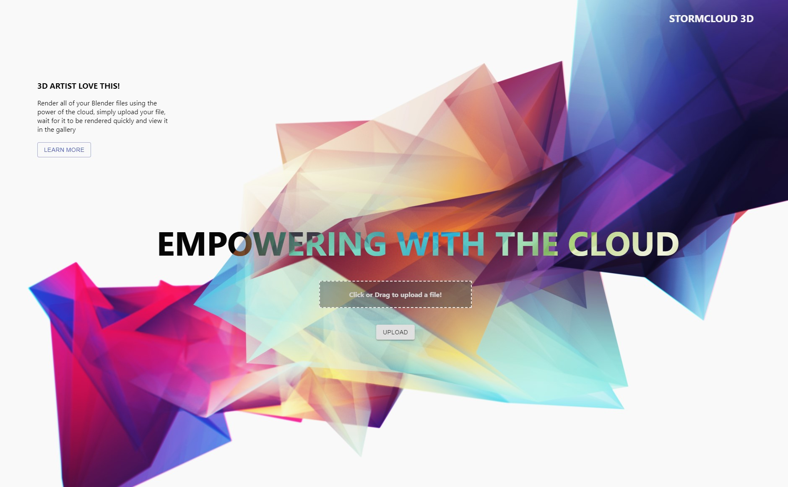
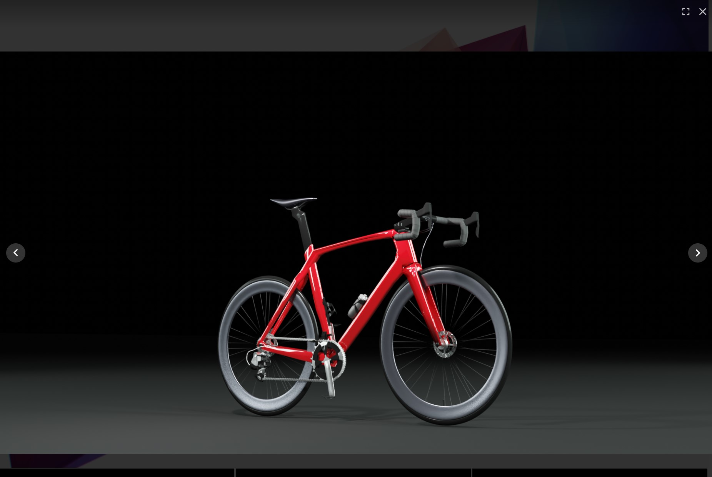

# Storm Cloud 3D

Web Based Cloud Rendering Application - All Renders are performed using AWS EC2 GPU Instances for quick render time.

The result is then uploaded to a public gallery and emailed to the user.

